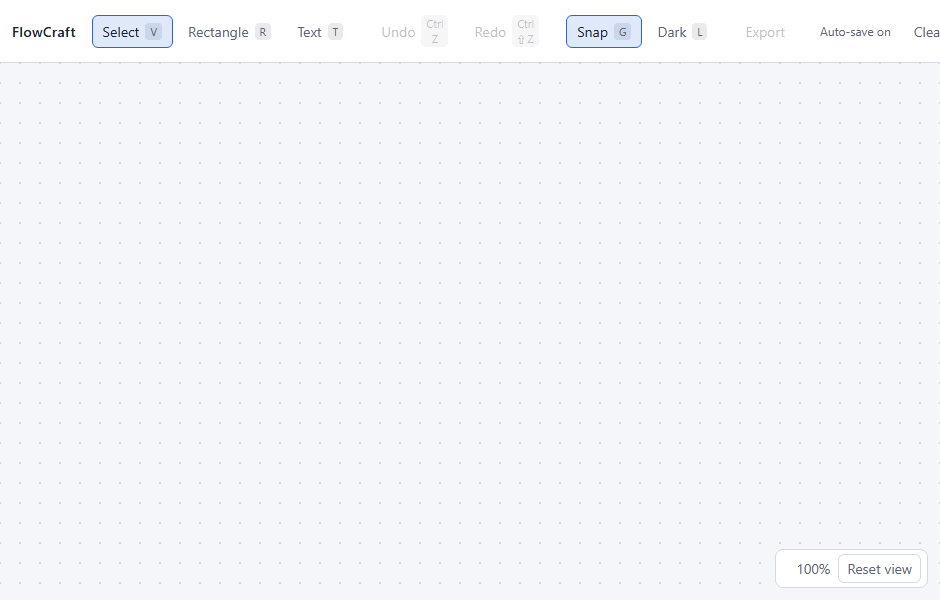

# FlowCraft

A visual flowchart editor that runs entirely in the browser. No backend, no
account, no upload — your diagram never leaves the tab.



Not deployed yet — `npm install && npm run dev` runs it locally in two
commands, and [DEPLOY.md](DEPLOY.md) has the hosting configuration ready to go.

Built from scratch on SVG: the drag-and-drop, the orthogonal connection
routing, the undo/redo, the grouping and the export are all first-party code,
not a diagramming library with a theme on top.

---

## What it does

|                 |                                                                                                                                                               |
| --------------- | ------------------------------------------------------------------------------------------------------------------------------------------------------------- |
| **Blocks**      | Rectangles and text labels. Click to place, double-click to rename, drag to move, eight handles to resize.                                                    |
| **Connections** | Hover a block for its four ports, drag onto another block. Routes are orthogonal, leave and arrive perpendicular, and re-route themselves when a block moves. |
| **Selection**   | Click, shift-click, or marquee. Move and style any number of elements at once.                                                                                |
| **Undo / redo** | Every edit, 100 deep. A whole drag is one entry; a held arrow key is one entry.                                                                               |
| **Styling**     | Fill, border, text colour, border width, text size on blocks; colour, width and dashes on arrows. Mixed selections say _Mixed_ rather than guessing.          |
| **Grouping**    | `Ctrl`+`G` binds blocks into a rigid unit that moves, copies and deletes as one. Double-click steps inside.                                                   |
| **Themes**      | Dark and light, following your system on first visit. A theme repaints what you did not paint yourself, and leaves what you did.                              |
| **Export**      | Standalone SVG, or PNG at 1× or 2×, framed on the content rather than the camera.                                                                             |
| **Auto-save**   | To IndexedDB, half a second after you stop typing. Reload and it is there.                                                                                    |

## Running it

Node 20 or newer.

```bash
npm install
npm run dev
```

## Testing

```bash
npm test          # 919 unit and component tests, ~13s
npm run test:e2e  # 67 end-to-end specs in real Chromium, ~16s
```

`npm test` is jsdom and stays fast enough to run on every save. The E2E specs
are deliberately not part of it; they need a browser and a dev server, and they
exist to answer the questions jsdom structurally cannot — layout, hit testing,
the SVG cascade, IndexedDB, and whether an exported PNG is a picture or a
correctly sized blank rectangle.

```bash
npm run test:e2e:ui                   # Playwright's UI mode, for debugging one spec
npx playwright test smoke             # the deployment smoke check
npm run measure:perf                  # time the production build on 500 blocks
npm run capture:demo                  # re-record the GIF at the top of this file
```

Everything, in the order CI would run it:

```bash
npm run typecheck && npm run lint && npm run format:check && npm test && npm run build && npm run test:e2e
```

## How fast it is

Measured with `npm run measure:perf`: the production bundle, in a real Chrome,
on a generated diagram far larger than anyone would draw by hand. Medians of
repeated samples.

|                                           | 500 blocks | 2,000 blocks | 5,000 blocks |
| ----------------------------------------- | ---------- | ------------ | ------------ |
| Cold load, navigation → diagram on screen | 114ms      | 103ms        | 138ms        |
| First render of the whole document        | 13ms       | 14ms         | 16ms         |
| Frame time while dragging                 | 16.7ms     | 16.7ms       | 16.7ms       |
| Click → selection outline                 | 14ms       | 15ms         | 13ms         |
| SVG elements in the DOM                   | 618        | 618          | 618          |

The numbers are **flat in document size** because the canvas only renders what
the viewport can show. Before Phase 7 they were not: a 5,000-block diagram put
39,009 SVG elements in the page, took 650ms to load and dragged at 30fps.

Two changes did it — one dead `memo` brought back to life, and viewport
culling. Both are written up, with what they cost and what was measured and
deliberately left alone, in
[ARCHITECTURE.md § Performance](ARCHITECTURE.md#performance).

## Controls

### Tools and view

| Action                          | Input                                                          |
| ------------------------------- | -------------------------------------------------------------- |
| Select / Rectangle / Text tool  | `V` / `R` / `T`                                                |
| Create a block                  | Pick a tool, click the canvas                                  |
| Edit block text                 | Double-click — `Enter` confirms, `Esc` cancels                 |
| Snap to grid (on by default)    | `G`, or the **Snap** button                                    |
| Invert snapping for one gesture | Hold `Alt`                                                     |
| Switch theme                    | `L`, or the theme button                                       |
| Zoom                            | Wheel or pinch, anchored at the cursor (0.1×–4×)               |
| Pan                             | Middle-drag, `Space`-drag, or drag with a creation tool active |
| Reset view                      | `0`                                                            |

### Editing

| Action                    | Input                                         |
| ------------------------- | --------------------------------------------- |
| Select / add to selection | Click / `Shift`+click                         |
| Marquee                   | Drag empty canvas (`Shift` to add)            |
| Select all blocks         | `Ctrl`+`A`                                    |
| Delete                    | `Delete` or `Backspace`                       |
| Nudge 1 unit / 20 units   | Arrow keys / `Shift`+arrows                   |
| Copy / paste / duplicate  | `Ctrl`+`C` / `Ctrl`+`V` / `Ctrl`+`D`          |
| Undo / redo               | `Ctrl`+`Z` / `Ctrl`+`Shift`+`Z` or `Ctrl`+`Y` |
| Group / ungroup           | `Ctrl`+`G` / `Ctrl`+`Shift`+`G`               |
| Step into a group         | Double-click a member                         |
| Cancel a drag             | `Esc` — puts everything back                  |

`Cmd` works in place of `Ctrl` on macOS.

## Stack

- **React 19 + TypeScript** in strict mode
- **Vite** for the dev server and build
- **SVG** rather than Canvas — the browser does hit testing and text layout,
  the tree is inspectable in DevTools, and the export is the same markup with
  the editing furniture left out
- **Zustand**, with a command pattern for undo/redo
- **@use-gesture/react** for pointer input
- **IndexedDB** for auto-save, behind an injectable driver
- **Vitest + Testing Library** for unit tests, **Playwright** for end-to-end
- **ESLint (flat config) + Prettier**

No diagramming library, no state-machine library, no UI kit.

## Architecture

The decisions behind the code — and the alternatives they were weighed against
— are in **[ARCHITECTURE.md](ARCHITECTURE.md)**. A few of the load-bearing
ones:

- Coordinates live in **world space**; pan and zoom go through the `viewBox`,
  never a CSS transform.
- **Connections store no geometry** — only two block ids. The polyline is
  re-derived every render, which is why arrows follow their blocks with no
  synchronising code anywhere.
- Every gesture runs through **one handler on the `<svg>`**, which snapshots
  state at the start and applies `snapshot + travel` per frame. Not
  `@use-gesture`'s `movement`, which latches the tap threshold and leaves a
  dragged block 3px behind the cursor forever.
- Undo is the **command pattern**, not document snapshots; commands hold copies,
  are idempotent, and all live in one file.
- Styles are **inline, never presentation attributes** — an attribute sits at
  the bottom of the SVG cascade and loses to the stylesheet, which passes every
  DOM assertion and renders the wrong colour.
- The export is **built from the document**, never scraped from the DOM.

## Deploying

**Not yet deployed.** The configuration and the verification are in place; the
hosting account is not.

`npm run build` produces a static `dist/`. `vercel.json` configures Vercel;
[DEPLOY.md](DEPLOY.md) covers the four things a host can quietly break — secure
context, CSP, MIME types and SPA fallback — and the smoke spec that checks all
four against a live URL:

```bash
E2E_BASE_URL=https://your-deployment npx playwright test smoke
```

## Known limitations

Things that are deliberately unfinished, with the reasoning rather than a
promise.

- **Multiple tabs are last-write-wins.** Two tabs on the same browser share one
  IndexedDB record and neither watches the other, so whichever saves last wins.
  Fixing it properly means a `BroadcastChannel` and a merge policy for two
  divergent documents, which is a feature in its own right; detecting it and
  refusing to save is the cheap half and would leave a user unable to work in
  the tab they are actually looking at.
- **The migration chain is empty, on purpose.** There is one document version
  and nothing to migrate. The walk is written, tested and wired in anyway,
  because the day a version 2 exists every document on disk is a version 1 and
  a path invented at that moment has to be right first time against data nobody
  can reproduce.
- **PNG export has no canvas-size guard.** At 2× a very large diagram can ask
  for a canvas past the browser's maximum dimension, where the rasteriser
  rejects with a message rather than saving a blank file — the failure is loud,
  but "try 1×" is advice the user has to work out. The right fix is to compute
  the achievable scale and offer that.
- **Groups cannot be resized**, only moved. Handles still appear for a single
  block only.
- **No routing around obstacles.** An arrow takes the direct orthogonal path
  and will cross a block that happens to sit in the way.
- **Select All on a very large diagram renders all of it**, because the
  selection is exempt from viewport culling — the same rule that stops a
  dragged block vanishing off the edge of the window.

## Future work

Ideas that would fit the existing architecture rather than fight it: more block
shapes (diamond, ellipse, cylinder), connection labels, alignment and
distribution commands, a JSON import to match the export, multi-tab
reconciliation over `BroadcastChannel`, and connection routing that avoids
obstacles.

## Status

**Feature-complete**, with the public deployment as the one outstanding item.
Built in seven phases:

1. ✅ Project setup, SVG canvas with pan/zoom, block creation
2. ✅ Drag-and-drop, multi-select, resizing
3. ✅ Connections between blocks, snap-to-grid
4. ✅ Undo/redo (command pattern), keyboard shortcuts
5. ✅ Element styling, grouping
6. ✅ PNG/SVG export, IndexedDB auto-save, dark/light themes
7. ✅ Performance, Playwright E2E, documentation — deploy still pending

## License

[MIT](LICENSE)
